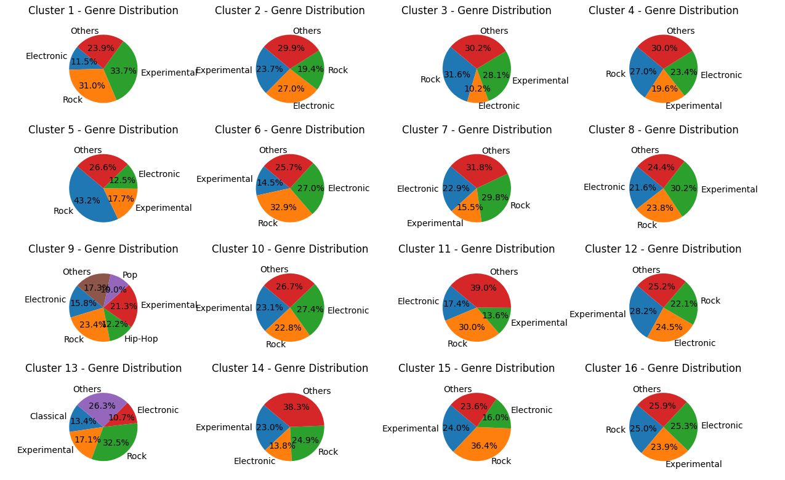

# Ex1 
 
## Ex 1.1

To run 
```bash 
$ spark-submit src/find_best_k.py fma_metadata/tracks.csv fma_metadata/features.csv results 
```

Note: The best value for k was found to be **16**.
## Ex 1.2 and 1.3

to run 
```bash 
$ spark-submit src/BFR.py fma_metadata/tracks.csv fma_metadata/features.csv results  
```


Note: We used the best value for k (16) from 1.1 for this step.

# To Do

Here are some points to improve the work:

1. Implement BFR using more spark features 
2. Improve the visual representation of clusters by using more sophisticated plotting techniques.
3. Implement additional metrics for evaluating the quality of the clusters.
